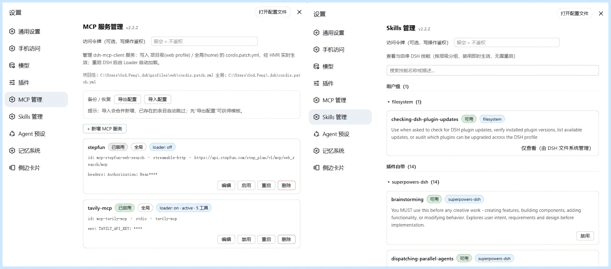

# dsh-mcp-manager

<!-- Hero -->
<div align="center">
  <b style="font-size: 1.15em;">DeepSeek Harness 的 MCP 服务管理器：装没装、连没连、一页管完。</b><br /><br />
  <code>服务器列表</code> <code>新增 / 编辑 / 删除</code> <code>启用 / 停用</code> <code>重启</code> <code>工具数健康</code> <code>JSON 导出 / 导入</code><br />
  <code>4 个模型工具</code> <code>HTTP API</code> <code>npx / npm / dsh plugin / 脚本</code><br /><br />
  <b>设置 → MCP 管理</b> 管理项目级与全局 <code>cordis.patch.yml</code> 中的 <code>@deepseek-ai/dsh-mcp-client</code> 行——<br />
  无需再手改配置文件，所有修改即改即生效（HMR 热应用），重启、升级后依然存在。
</div>

<div align="center">

[](https://www.npmjs.com/package/@xxxyz/dsh-mcp-manager)
[](LICENSE)
[](package.json)
[](https://github.com/xxxyz/DeepSeekHarness-MCP-Manager)
[](https://dsh.market)
[](https://github.com/awesome-dsh-plugin/awesome-dsh-plugin/pull/2078)

</div>

<div align="center">
  🛒 已收录于 <a href="https://dsh.market"><b>dsh.market</b></a> · 已提交 <a href="https://awesome-dsh-plugin.com"><b>awesome-dsh-plugin.com</b></a> 官方列表收录（<a href="https://github.com/awesome-dsh-plugin/awesome-dsh-plugin/pull/2078"><b>PR #2078</b></a> 待合并）
</div>

<div align="center">
  🌏 <a href="./README.md"><b>中文</b></a> · <a href="./README_EN.md">English</a>
</div>

<br />

<p align="center"></p>

## ✨ 功能一览

- **📋 服务器列表**：列出所有已配置的 MCP 服务器（`@deepseek-ai/dsh-mcp-client` 实例）——`serverName`、传输方式（`stdio` / `streamable-http`）、URL / 命令、启用状态、loader 实时加载阶段、已注册工具数
- **➕ 新增 / ➖ 删除**：表单添加 MCP 服务器（支持 env / headers / args），带格式与重名校验；一键删除
- **🔌 启用 / 停用**：随时切换，工具随之热连接 / 热断开
- **🔄 重启**：disable + re-enable，自动重连并重新同步工具
- **💾 持久化**：写入**项目级**（`profiles/<profile>/cordis.patch.yml`）或**全局**（`~/.dsh/cordis.patch.yml`），重启后保留；页面底部显示文件路径
- **🩺 健康检查**：每台服务器实时工具数与 loader 阶段，异常一目了然
- **📦 备份 / 恢复**：JSON 导出 / 导入，合并新增、已存在自动跳过
- **🤖 模型工具**：宿主注册 4 个 `mcp_manager_*` 工具，模型可直接查询与操作 MCP 服务
- **🌐 HTTP API**：`POST /dsh-mcp-manager/api`（JSON `{op, args}` → `{ok, ...}`），供客户端与脚本调用。带跨站（CSRF）防护：仅接受 POST、必须携带 `x-dsh-plugin: dsh-mcp-manager` 请求头、校验同源 Origin（curl 等本地脚本无需 Origin）
- **📦 跨平台安装**：Windows / macOS / Linux 一条命令（npx / npm / `dsh plugin` / 脚本）

## 🚀 安装

**前置**：DSH 已装好（`dsh web` 能正常运行），Node.js ≥ 18。

### 方式一 · npx 一条命令（推荐）

```sh
npx -y @xxxyz/dsh-mcp-manager
```

所有参数照常透传：`npx -y @xxxyz/dsh-mcp-manager --dsh-home /path/.dsh --profile web --repair --port 3080`。

### 方式二 · npm 全局安装（适合经常使用）

```sh
npm i -g @xxxyz/dsh-mcp-manager
dsh-mcp-manager                  # 安装插件
dsh-mcp-manager-uninstall        # 卸载插件
npm i -g @xxxyz/dsh-mcp-manager@latest   # 升级
```

### 方式三 · dsh 命令安装（bundle 方式）

```sh
dsh plugin --profile web add @xxxyz/dsh-mcp-manager
# 或 GitHub 源（构建产物 lib/ 已入库，无需本地构建）
dsh plugin --profile web add github:xxxyz/DeepSeekHarness-MCP-Manager
```

### 方式四 · 免 npm 账号：GitHub 直拉

```sh
npx -y github:xxxyz/DeepSeekHarness-MCP-Manager
```

<details>
<summary><b>脚本安装</b>（源码方式：下载仓库后执行，幂等）</summary>

**Windows（PowerShell）**：

```powershell
.\dsh-mcp-manager\install.ps1                     # 默认 ~/.dsh + web profile
.\dsh-mcp-manager\install.ps1 -DshHome D:\path\.dsh -Profile web
```

**macOS / Linux（bash）**（无执行权限先 `chmod +x dsh-mcp-manager/install.sh`）：

```sh
./dsh-mcp-manager/install.sh                      # 默认 ~/.dsh + web profile
./dsh-mcp-manager/install.sh --dsh-home /path/.dsh --profile web
```

**任何平台直接运行**：

```sh
node dsh-mcp-manager/install.mjs [--dsh-home <path>] [--profile <name>] [--port <n>] [--repair] [--skip-patch]
```

安装脚本会：① 复制到 `local-packages/`（真源备份，DSH 升级不动它）② 复制到 `profiles/node_modules/`（普通复制而非软链接，保证 ESM 能解析 `@deepseek-ai/dsh-tools`）③ 幂等追加 loader 行（insert 块）。

</details>

装完**硬刷新浏览器**（Cmd/Ctrl+Shift+R），打开 **设置 → MCP 管理** 即可看到管理页。若未出现，重启一次 DSH（host 半首次挂载需要）。

<details>
<summary><b>卸载</b></summary>

```sh
dsh-mcp-manager-uninstall                          # 若用 npm -g 安装
# 或：.\uninstall.ps1 | ./uninstall.sh | node uninstall.mjs [--dsh-home <path>] [--profile <name>]
```

然后重启 DSH。卸载删除部署副本、`local-packages` 真源，并清理 loader 行（补丁保持合法）。

</details>

<details>
<summary><b>DSH 升级后：--repair</b></summary>

DSH 升级（或 HMR 状态异常）后若 **设置里没有"MCP 管理"** 或 **`mcp_manager_*` 工具消失**，运行一次修复命令：重新部署 → 递增 loader 行 `config.version`（触发 HMR 重应用）→ 轮询 API 直到 `{ok:true}`（默认 30 秒）。

```sh
node dsh-mcp-manager/install.mjs --repair --port 3080
# PowerShell: .\install.ps1 -Repair -Port 3080    bash: ./install.sh --repair --port 3080
```

仍不恢复则重启一次 DSH（loader 启动时重新导入）。

</details>

<details>
<summary><b>常见问题</b></summary>

| 现象 | 原因与解决 |
|---|---|
| 装完设置里没有"MCP 管理" | 硬刷新（Cmd/Ctrl+Shift+R）；仍没有就重启 DSH 一次。 |
| 页面出现**两个 MCP 页签 / 工具重复** | 双挂载：同时用了 install.mjs 与 `dsh plugin add` 两种方式。卸载其中一种（`dsh-mcp-manager-uninstall` 或删掉对应的 loader 行 / `dsh.profile.bundles` 条目）。 |
| DSH 升级后工具消失 | 跑一次 `--repair`（见上）。 |
| `npx` / `npm view` 报 404 | 国内镜像（npmmirror）同步有延迟：加 `--registry=https://registry.npmjs.org` 或稍等再试。 |
| 安装脚本报错 `EPERM` | DSH 正在运行占用了文件：先退出 DSH 再装。 |
| 修改配置后未生效 | 所有修改走 HMR 热应用，等 1–2 秒自动刷新；页面会自动轮询。 |

</details>

## 📖 使用说明

打开 **设置 → MCP 管理**：

- **添加服务器**：填写 `serverName`（唯一，1–32 位 `[A-Za-z0-9_-]`）、传输方式及对应字段（`streamable-http` 填 URL / headers；`stdio` 填 command / args / env），选择级别（项目级 / 全局）。面板做格式与重名校验。
- 每张卡片显示实时状态、连接目标与工具数；可 **启用 / 停用**、**重启**、**编辑**、**删除**。
- **备份 / 恢复**：一键导出 JSON，或粘贴 JSON 导入（合并新增，已存在自动跳过）。
- 页面底部显示正在编辑的补丁文件路径。

## ⚙️ 配置

插件自身在 loader 行中的配置：

| 字段 | 说明 |
|---|---|
| `version` | loader 行 `config.version`。`--repair` 会将其递增以强制 HMR 重应用，无需手动修改。 |

loader 行必须为 **`insert` 块**形式（DSH patch 方言中普通 `- id:` 行只是对已存在条目的覆盖，无法新增插件）：

```yaml
- insert:
    - id: dsh-mcp-manager
      name: dsh-mcp-manager
      config:
        version: 1
```

## 🏗️ 架构

- **宿主端**（`src/index.ts` → `lib/index.js`，对象形态 Cordis 插件 `{name, inject, apply}`）：`inject` 声明 `timer/fs/settings/sandboxPolicy/webServer/tools`，框架保证就绪并在依赖消失时自动重载——这是插件跨 DSH 升级存活的机制。注册 4 个模型工具（`ctx.tools.register(defineTool(...))`）与精确路由 `POST /dsh-mcp-manager/api`（`ctx.effect` 作用域化清理）；对 `cordis.patch.yml` 做行级 CRUD（迷你 YAML 解析 + 按文件写锁）。
- **浏览器端**（`lib/client.js`，ModuleLoader CJS bundle）：注册 设置 → MCP 管理 页（`settings.section` 槽位，order 16），经同源 `fetch('/dsh-mcp-manager/api')` 与宿主通信，不直接访问文件系统。
- **loader 行**：写入 profile 的 `cordis.patch.yml`，client-modules 服务扫描启用的条目并下发客户端 bundle。
- **安装器**：`install.mjs`（跨平台核心）/ `install.ps1` / `install.sh` + 对应的 `uninstall.*`；npm 包 `@xxxyz/dsh-mcp-manager` 的 bin 直接执行安装器（`dsh-mcp-manager` / `dsh-mcp-manager-uninstall`）。

## 🛠️ 开发

```bash
npm install
npm run build        # tsc -p tsconfig.json → lib/index.js（宿主端）
```

- 宿主插件源码：`src/index.ts`；浏览器 bundle：`lib/client.js`（手写，无需构建）
- 包本身纯 JS、零依赖、跨平台；构建只需 devDependencies（typescript、`@deepseek-ai/cordis`、`@deepseek-ai/dsh-tools`、`@types/node`）
- 发布：`npm version patch && npm publish`（`prepublishOnly` 自动构建；scoped 包已配置 `publishConfig.access: public`）

## 许可证

MIT
